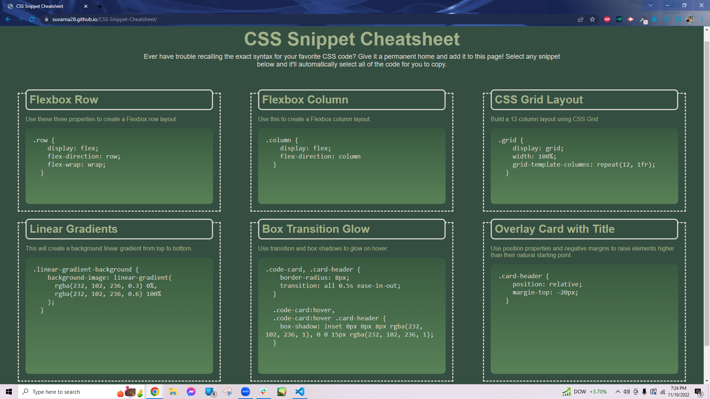
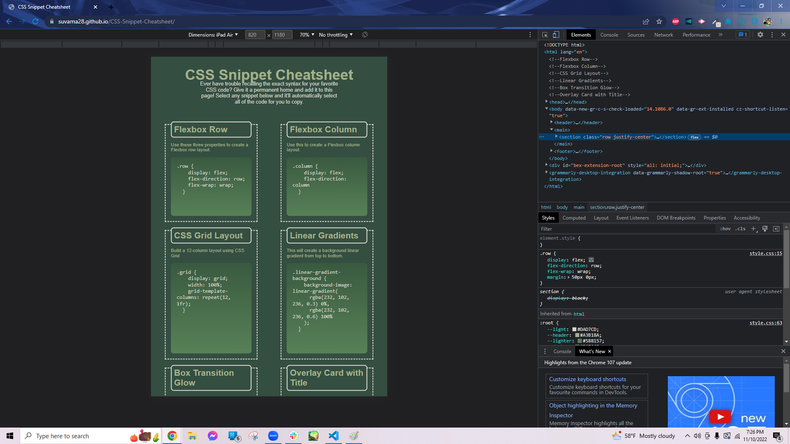
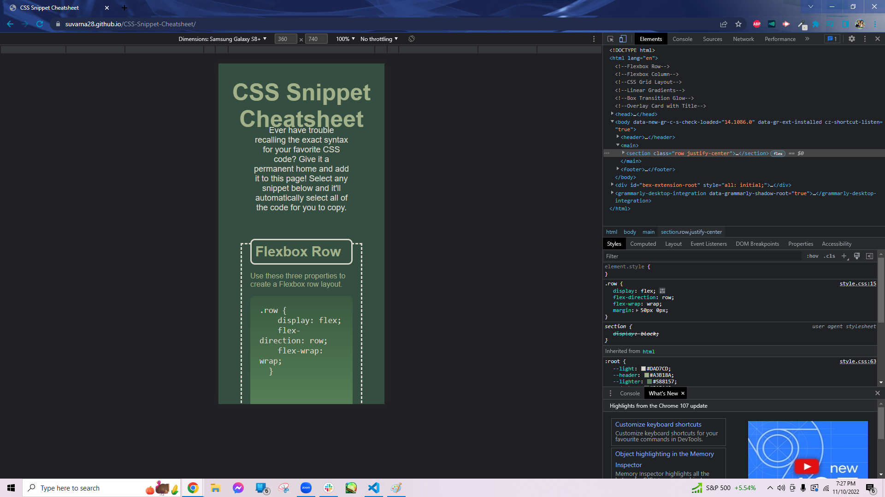

# CSS-Snippet-Cheatsheet

## Description

This project was a collaborative effort to display a collection of Cascading Style Sheet (CSS) concepts on a single responsive webpage as a way to study and put into practice CSS concepts. This website will be viewable on mobile, tablet, and computer devices. This project also provided an opportunity for the collaborators to practice working in the a repository with multiple contributors. 

## Usage

* Please click on the following link of the deployed website, https://suvarna28.github.io/CSS-Snippet-Cheatsheet/

* The following display should appear on screens at screen sizes 992px and above:

    

* The following display should appear on screens at screen sizes 768px and above:

    

* The following display should appear on screens at screen sizes 768px and below:

    

## Credits

[Andre Brahin](https://github.com/VenBak), [MaSandra Ewing](https://github.com/mewing0328), [Suvarna Jadhav](https://github.com/suvarna28), and [Claire Lee](https://github.com/leeclaire156) contributed to this repository.

HTML code belongs to George Washington University's Full Stack Coding BootCamp.

## Features

* Responsive layout for easy viewing of CSS concepts on any device.

* Each CSS snippet highlights entire code's text for copying on click.

* Color palette can easily be swapped out with using CSS root.
